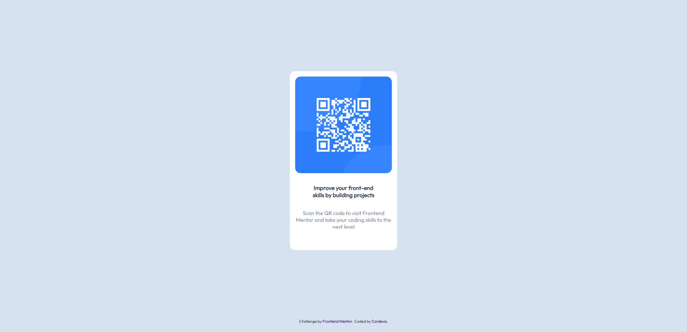

# Frontend Mentor - QR code component solution

This is a solution to the [QR code component challenge on Frontend Mentor](https://www.frontendmentor.io/challenges/qr-code-component-iux_sIO_H).  

## Table of contents

- [Screenshot](#screenshot)
- [Links](#links)
- [Built with](#Built-with)
- [What I learned](#what-i-learned)
- [Demo](#Demo)

### Screenshot

### Built with

- Semantic HTML5 markup
- CSS custom properties
- Flexbox
- Mobile-first workflow

### What I learned

How to effictively center items into a page wihtout much complications

## Demo 

You can check out a live demo of this website [Click here](https://xcordeva.github.io/qr-code-page-FrontendmentorChallenges).

